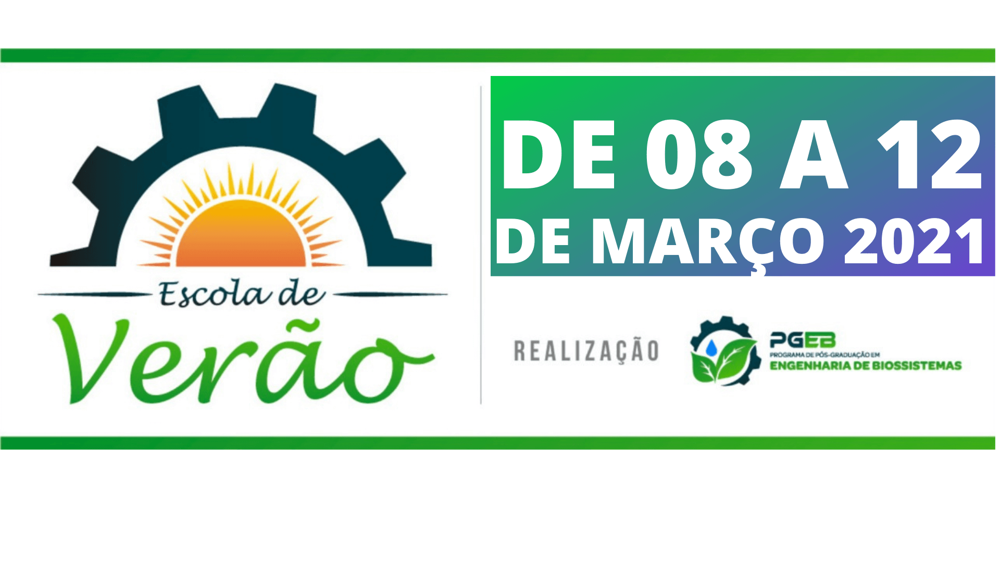

# Universidade Federal Fluminense - UFF
## Programa de Pós-Gradução em Engenharia de Biossistemas
# Escola de Verão 2021
---
## Python para Data Science
### Prof. Dr. Jorge Zavaleta
---
Objetivo do curso:

## Ementa
|        |   Tema                   | Jupyter Notebook | PDF       |
|:-------|:-------------------------|:-----------------|:---------:|
|Segunda | Tipos de Dados           |                  |       |
|Terça   | Estruturas de Controle   |                  |       |
|Quarta  | Numpy e Pandas           |                  |       |
|Quinta  | Visualização de Dados    |                  |       |
|Sexta   | Aplicações               |                  |       |

#### Bibligrafia

---
Python para Data Science \&copyrights, Jorge Zavaleta, 2021
