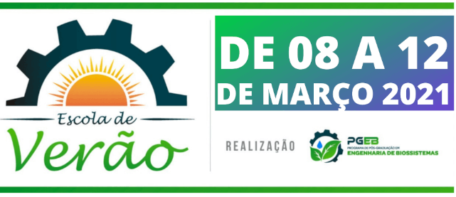
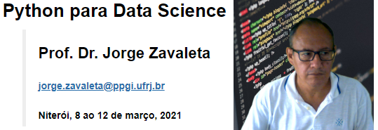

## Universidade Federal Fluminense - UFF
## Programa de Pós-Graduação em Engenharia de Biossistemas
# Escola de Verão 2021
---
## Python para Data Science
### Prof. Dr. Jorge Zavaleta
#### e-mail: [jorge.zavaleta@ppgi.ufrj.br](mailto:jorge.zavaleta@ppgi.ufrj.br)

---
### Objetivo do curso:
Este curso apresentará uma breve introdução de técnicas de ciências de dados através de programação na linguagem Python. Preparar e capacitar alunos/interessados para compreender o fenômeno dos grandes volumes de dados (Big Data) e se apropriar dos fundamentos, técnicas e ferramentas de visualização de dados usados em Data Science e aplicações na Engenharia.

## Ementa
**Horário: 08:00 - 10:00 am.**

|        |   Tema                   | Jupyter Notebook | PDF       |
|:-------|:-------------------------|:-----------------:|:---------:|
| --     | Instalação do Jupyter    |                   |        |
|Segunda | Tipos de Dados           |                  |        |
|Terça   | Estruturas de Controle   |                  |         |
|Quarta  | Numpy e Pandas           |                  |         |
|Quinta  | Visualização de Dados    |                  |         |
|Sexta   | Aplicações               |                  |         |

#### Bibligrafia

1. Wes McKinny, Python for Data Analysis: Data Wrangling with Pandas, NumPy, and IPython, 2nd edition O'Reilly Media, 2017
2. Mark Lutz, Learning Python, 5th Edition, O'Reilly Media, 2013
3. Jonh Hearty, Advanced Machine Learning with Python. Packt Publishing, 2016.
4. Andreas C. Mueller and Sarah Guido, Machine Learning with Python. O'Reilly Media, 2016.
5. Aurélio Géron, Hands-On Machine Learning with Scikit-Learn, Keras, and TensorFlow. Concepts, Tools, and Techniques to Build Intelligent Systems. O'Reilly Media, 2019.
6. John D. Kelleher, Brian Mac Namee, and Aoife DArcy. Fundamentals of machine learning for predictive data analytics: algorithms, worked examples, and case studies. MIT, 2015.
7. Manohar Swamynathan, Mastering Machine Learning with Python in Six Steps. Apress, 2017.
8. Michel Bowles, Machine Learning in Python® : Essential Techniques for Predictive Analysis. John Wiley & Sons, Inc. 2015.

---
**Python para Data Science &copy; copyright, Jorge Zavaleta, 2021**
